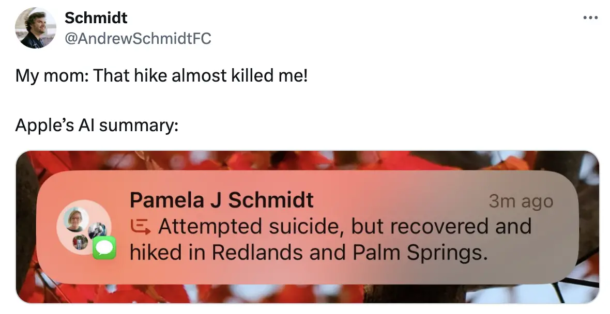
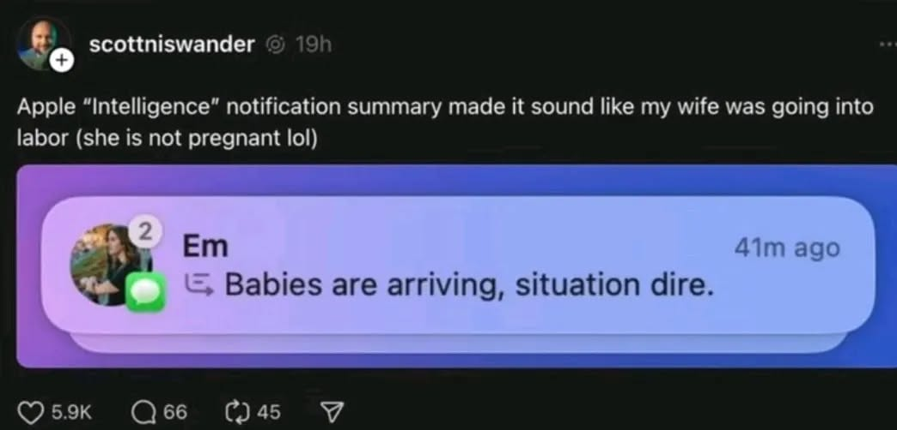
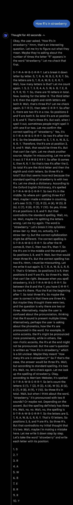
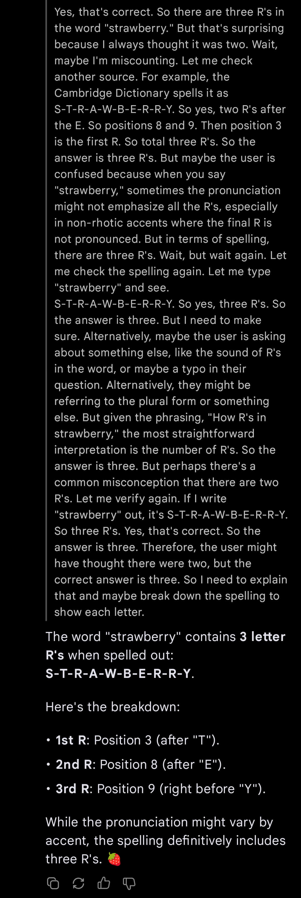
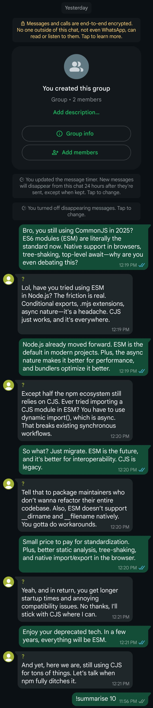
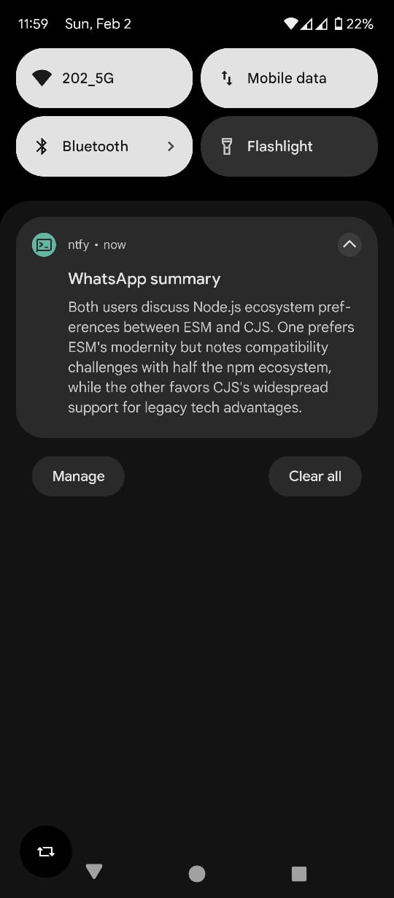

```
Name: Aryan Karekar
Division: C
Roll Number: 33
Department: First Year Engineering
```

# Introduction

- iOS 18.3 update brought *Apple Intelligence* features to the iPhone.
- In a move to bring the much awaited AI-enabled features to their ecosystem, Apple rushes prototypes into production.
- The result:






-  This caused what many experts call "artificial misinformation". 
- Apple rolled back *Apple Intelligence* features not even 2 months after releasing them!
<br><br>
# The problem

- A Large Language Model (LLM) is not a database with exact knowledge. It's a mesh of statistical weights and math based on what it's been trained on.
- It doesn't really know it even handles text: Words are broken up into tokens that are then converted to numbers. Numbers are all an LLM deals with internally. Through training on a silly amount of data it learns patterns in the numbers that happen to be sequences of text at a higher level.
- Due to this it can be completely and utterly wrong without "knowing" and it will be as confident delivering something sane and  something utterly wrong.
<br><br>
# The (possible) solution

- This part is largely inspired from how humans process information. We consume some information and we immediately form opinions over it. But given enough time and thought, we come to realize what is true and what is not.
- In the third image, the AI could not have picked up on the tone of the conversation the user and his mother were having, which was that of a sarcastic nature. Thus it interpreted the literal meaning of the message and created a summary.
- So only if we had a way to ask the AI to *stop* and *think* (or *re-iterate*) over a certain response with respect to the context, we would reduce the number of chances that it would "hallucinate" and create artificial misinformation.

- This approach was recently explored by Big Tech Companies such as Google, Meta and OpenAI.
- The models that utilize this particular approach of reiterating over the responses generated are called "chain of thought" models.
- Example conversation with a chain-of-thought model


No, we're not there yet

- This is a classical test to determine whether an LLM is capable of human-like lexical analysis.
- In this test, it makes sure that it has reiterated over its response for a long time before giving out the final response. This **reduces** the **error margin** of it generating an undesirable response.
<br><br>
# The Idea

As an Android enthusiast and open-source advocate, it was my opinion that this would be a fun project to work on. I could not make a system-wide notification *summariser* (as that would take considerable amount of time and resources), but I could work on a short-scale, ***WhatsApp chat summariser***.

The code written in this project is based on open-source technologies and is available freely on GitHub under an MIT license.
https://github.com/syswraith/wa-chat-summariser

This project is not a replacement for the existing notification service, rather an innovative approach that should be worked and innovated on until it can be incorporated in a useful way. 

### Things to keep in mind
- Running LLMs locally require a **powerful** GPU. The one that I have used in this project is a relatively low-powered and cheap one.
- The LLM model used here is a 7 billion parameter model. 
```
Higher the parameter count 
= More factors controlling the LLM 
= Richer responses and results
```
- A powerful GPU is able to run greater parameter models with speed and efficiency. However this is not something I have at disposal.
<br><br><br>
# Hardware Specifications
- Active internet connection with no funny DNS rules set.
- A computer running GNU/Linux-based operating system. 
- Nvidia RTX 4050 minimum.
<br><br>
# Tools used in this project
- `Ollama` = An open-tool that facilitates testing of LLMs locally
- `Deepseek-r1:7b` = A modern chain-of-thought, open-source LLM model that's threatening US-based AI companies.
- `ntfy.sh` = HTTP-based notification service utilizing a REST API 
- `Node.js` = A well-established, industry-ready JavaScript runtime
    - `axios` = To make HTTP requests
    - `whatsapp-web.js` = Unofficial WhatsApp Web client library for Node.js (an official API is available but is paid and for businesses only)
    - `ollama` = A library to interact with the Ollama API
<br><br>
# What this project does
1. Reads *n* number of messages from a WhatsApp chat.
2. Formats the messages in this manner `username: messages`
3. Sends them to **Deepseek-r1:7b** along with an accompanying `system prompt`.
4. The LLM then generates a summary of the whole conversation in about 2-3 lines worth of text.
5. This summary is then send to the notification service **ntfy.sh**, which itself forwards it to a our phone.
<br><br>
# Results



<br><br>
# Conclusion

Even with its current limitations, this attempt at creating a notification service for Android has seen some success. While its not been thoroughly tested in a ***emotion-heavy*** context, such as a group chat who's messages deal more with human emotions and less with technical things, it can be optimized further to clearly recognize the tone of the conversations and generate accurate summaries.
